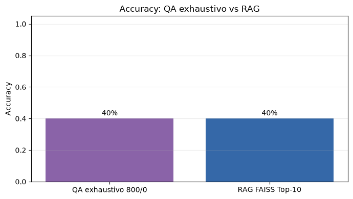
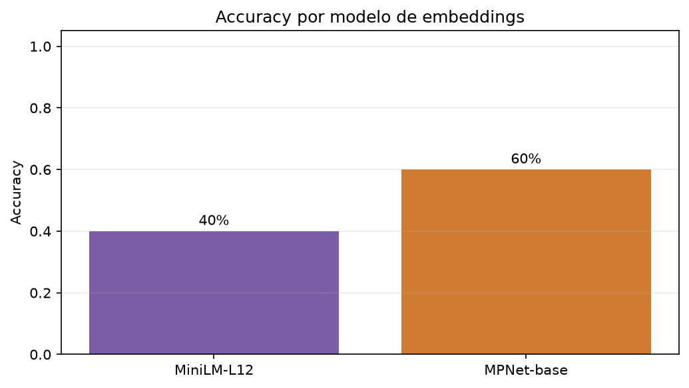
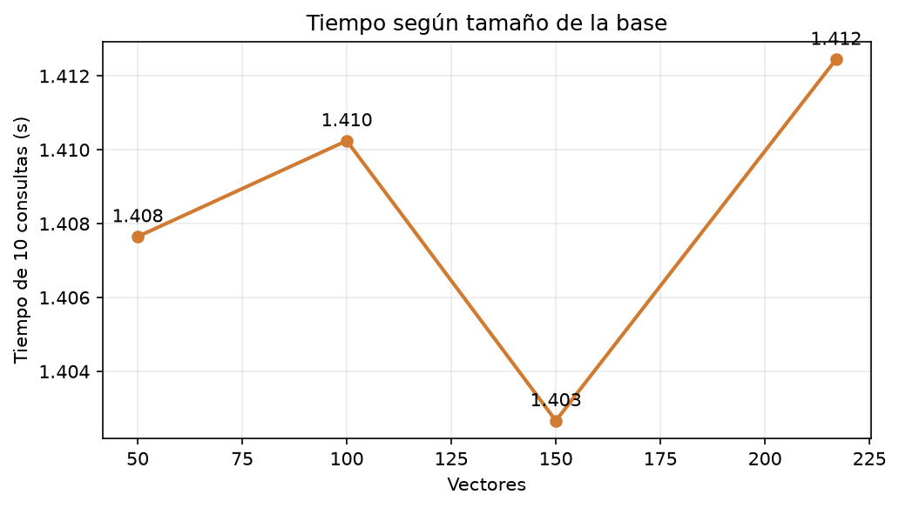
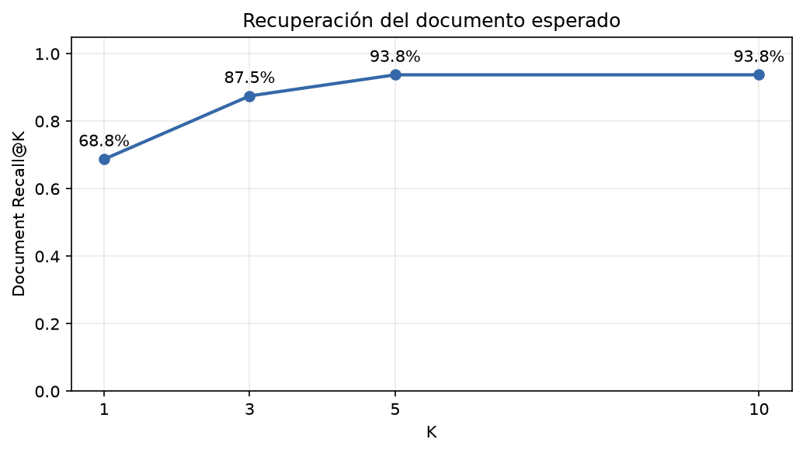
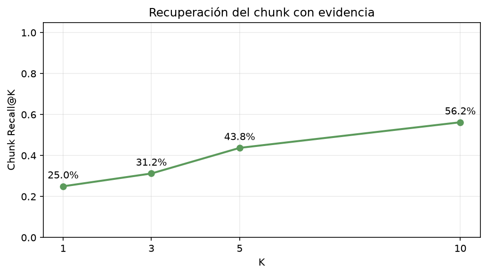

# Resultados y análisis

Este documento concentra la evidencia cuantitativa. Los resultados históricos se identifican como tales y no se mezclan con la configuración MPNet final. El score QA se interpreta como confianza del extractor, no como exactitud.

## 1. Comparación de modelos QA

### Resultados por contexto

| Contexto | Modelo | Correctas | Exactas | Score medio | Tiempo medio (s) |
|---|---|---:|---:|---:|---:|
| UES | BETO-SQuAD2 (mrm8488) | 4/5 | 3 | 0.639995 | 0.0620 |
| UES | BETO-SQuAD2 (MMG) | 5/5 | 5 | 0.536869 | 0.0630 |
| UES | BETO-SQAC (MMG) | 5/5 | 2 | 0.615832 | 0.0612 |
| Bases de datos | BETO-SQuAD2 (mrm8488) | 4/5 | 2 | 0.436674 | 0.1833 |
| Bases de datos | BETO-SQuAD2 (MMG) | 4/5 | 2 | 0.329666 | 0.1774 |
| Bases de datos | BETO-SQAC (MMG) | 5/5 | 3 | 0.778458 | 0.1818 |
| Wikipedia adaptada | BETO-SQuAD2 (mrm8488) | 5/5 | 4 | 0.546924 | 0.1192 |
| Wikipedia adaptada | BETO-SQuAD2 (MMG) | 4/5 | 4 | 0.408166 | 0.0992 |
| Wikipedia adaptada | BETO-SQAC (MMG) | 5/5 | 4 | 0.681568 | 0.1033 |

### Resultado global

| Modelo | Correctas | Accuracy | Exactas | Score medio global | Tiempo medio global (s) |
|---|---:|---:|---:|---:|---:|
| BETO-SQuAD2 (mrm8488) | 13/15 | 86.67 % | 9 | 0.541198 | 0.1215 |
| BETO-SQuAD2 (MMG) | 13/15 | 86.67 % | 11 | 0.424900 | 0.1132 |
| BETO-SQAC (MMG) | 15/15 | 100 % | 9 | 0.691953 | 0.1154 |

La figura pertenece al contexto inicial, no al agregado de los tres dominios. Allí las diferencias de tiempo fueron pequeñas y el mayor score no decidió por sí solo la selección. El agregado mostró que BETO-SQAC fue el único sin errores, aunque BETO-SQuAD2 (MMG) obtuvo más spans exactos y menor tiempo medio. La decisión priorizó respuestas correctas.

## 2. Chunking y overlap

| Configuración | Chunks | Correctas | Accuracy | Score medio | Tiempo total (s) |
|---|---:|---:|---:|---:|---:|
| 300/0 | 579 | 3/10 | 30 % | 0.935121 | 288.147 |
| 300/50 | 694 | 4/10 | 40 % | 0.915775 | 350.798 |
| 500/0 | 347 | 3/10 | 30 % | 0.917160 | 223.805 |
| 500/100 | 434 | 4/10 | 40 % | 0.938941 | 325.274 |
| 800/0 | 217 | 4/10 | 40 % | 0.942767 | 236.143 |
| 800/150 | 267 | 4/10 | 40 % | 0.898146 | 282.039 |

El overlap elevó las respuestas correctas de tres a cuatro en 300 y 500 caracteres. No produjo mejora para 800 caracteres y siempre incrementó chunks y tiempo. La variante 500/100 alcanzó la mayor mediana, 0.952259, pero usó 434 chunks y 325.274 s. La configuración 800/0 fue seleccionada porque empató en correctas, tuvo el mayor score promedio entre las empatadas y utilizó menos tiempo y fragmentos.

La pregunta 10 no fue respondida por ninguna combinación. Este resultado impide afirmar que el solapamiento solucionó el caso de borde.

## 3. Baseline exhaustivo

El baseline final reutilizó 800/0:

| Métrica | Valor |
|---|---:|
| Chunks | 217 |
| Preguntas | 10 |
| Inferencias QA | 2 170 |
| Correctas | 4/10 |
| Accuracy | 40 % |
| Score QA medio | 0.942767 |
| Tiempo total | 236.143 s |

El hallazgo central es la coexistencia de 40 % de accuracy con score medio 0.942767. Seleccionar el máximo entre todos los chunks permitió que spans muy seguros de artículos irrelevantes superaran a la evidencia. El score no midió pertinencia documental.

## 4. RAG MiniLM

La etapa histórica usó MiniLM, 384 dimensiones, 217 chunks y Top-10.

| Métrica | Valor |
|---|---:|
| Correctas | 4/10 |
| Accuracy | 40 % |
| Recall@10 | 40 % |
| Score QA medio | 0.836432 |
| Tiempo de consultas | 1.408 s |
| Inferencias QA | 100 |

MiniLM no mejoró la accuracy del baseline, pero redujo el espacio sometido a BETO. Las preguntas recuperadas [1, 3, 4, 7] fueron exactamente las correctas. Esto indicó que, en esa ejecución, el cuello de botella principal era recuperar evidencia completa.

## 5. Baseline frente a RAG

| Método | Correctas | Accuracy | Score QA | Tiempo (s) | Inferencias |
|---|---:|---:|---:|---:|---:|
| QA exhaustivo 800/0 | 4/10 | 40 % | 0.942767 | 236.143 | 2 170 |
| RAG MiniLM Top-10 | 4/10 | 40 % | 0.836432 | 1.408 | 100 |

Las barras iguales confirman que MiniLM Top-10 no aportó precisión en esa etapa.

El cociente temporal registrado fue $167.75\times$ y la reducción de inferencias 95.4 %, equivalente a evitar 2 070 evaluaciones QA. La preparación inicial de embeddings, 0.595 s, y del índice, 0.000306 s, se reportó aparte.

El conteo de inferencias representa una reducción arquitectónica. El speedup temporal debe matizarse porque el baseline se registró en CPU y la fase RAG posterior en CUDA. No es posible atribuir toda la diferencia de segundos exclusivamente a FAISS.

## 6. Comparación de embeddings

| Modelo | Dimensión | Recall@10 | Correctas | Accuracy | Score QA | Embeddings (s) | Consultas (s) |
|---|---:|---:|---:|---:|---:|---:|---:|
| MiniLM-L12 | 384 | 40 % | 4/10 | 40 % | 0.836432 | 0.536 | 1.432 |
| MPNet-base | 768 | 60 % | 6/10 | 60 % | 0.861635 | 1.642 | 1.420 |

MPNet elevó la accuracy en 20 puntos porcentuales sin cambiar BETO, chunking, preguntas ni Top-K.

La mejora de Recall también fue de 20 puntos. El resultado conecta la mejora final con la recuperación. El coste estuvo en la preparación: MPNet tardó 3.06 veces más en generar la matriz. El tiempo de las diez consultas fue similar en esta ejecución.

## 7. Tamaño de la base vectorial

Todas las bases conservaron 11 chunks obligatorios únicos y la evidencia de 10/10 preguntas.

| Vectores | Distractores | Recall@10 | Correctas | Accuracy | Score QA | Índice (s) | Consultas (s) |
|---:|---:|---:|---:|---:|---:|---:|---:|
| 50 | 39 | 70 % | 5/10 | 50 % | 0.810820 | 0.000039 | 1.408 |
| 100 | 89 | 70 % | 6/10 | 60 % | 0.786065 | 0.000138 | 1.410 |
| 150 | 139 | 60 % | 6/10 | 60 % | 0.832562 | 0.000071 | 1.403 |
| 217 | 206 | 60 % | 6/10 | 60 % | 0.861635 | 0.000091 | 1.412 |

El descenso de 70 % a 60 % al incorporar distractores muestra que la evidencia perdió posiciones en el ranking aunque permanecía almacenada.

La amplitud entre los tiempos fue 0.010 s. Con Top-10 fijo, BETO procesó la misma cantidad máxima de contextos. Los tiempos de indexación fueron inferiores a 0.001 s; las diferencias pequeñas de una ejecución no permiten inferir una ley de escalabilidad.

## 8. Resultado final

| Componente o métrica | Valor final |
|---|---|
| Modelo QA | `MMG/bert-base-spanish-wwm-cased-finetuned-sqac` |
| Embeddings | `sentence-transformers/paraphrase-multilingual-mpnet-base-v2` |
| Dimensión | 768 |
| Chunk | 800 caracteres |
| Overlap | 0 |
| Top-K | 10 |
| FAISS | `IndexFlatIP` |
| Base | 217 vectores |
| Correctas | 6/10 |
| Accuracy | 60 % |
| Recall@10 | 60 % |

La configuración final mejoró en 20 puntos la accuracy y Recall respecto del RAG MiniLM histórico. Aun así, cuatro preguntas permanecieron sin respuesta correcta. El resultado describe un avance dentro de la misma muestra y no una generalización a otros documentos.

## 9. Extensión multidocumento

| Métrica | Resultado |
|---|---:|
| Document Accuracy@1 | 68.75 % |
| Document Recall@3 | 87.50 % |
| Document Recall@5 | 93.75 % |
| Document Recall@10 | 93.75 % |
| Chunk Recall@1 | 25.00 % |
| Chunk Recall@3 | 31.25 % |
| Chunk Recall@5 | 43.75 % |
| Chunk Recall@10 | 56.25 % |
| MRR documento | 0.7833 |
| MRR chunk | 0.3188 |
| QA Accuracy respondible | 4/16, 25.00 % |
| QA Accuracy global | 4/18, 22.22 % |
| Abstención correcta | 0/2 |

La base creció de 217 a 765 vectores y de 0.64 a 2.24 MiB. El documento
esperado apareció casi siempre en Top-10, pero la evidencia exacta solo en nueve
preguntas. Tres casos completaron respuesta, fuente y chunk; una cuarta
respuesta textual correcta procedió de un documento diferente y se mantuvo
como falso positivo documental.

La comparación con el 60 % monodocumento no es pareada porque cambian las
preguntas. Su valor es descriptivo: añadir fuentes relacionadas introdujo una
etapa documental y expuso errores que el experimento original no podía medir.
