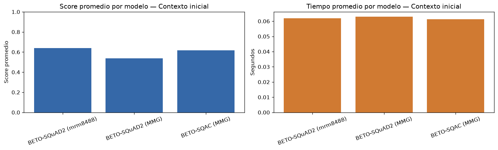
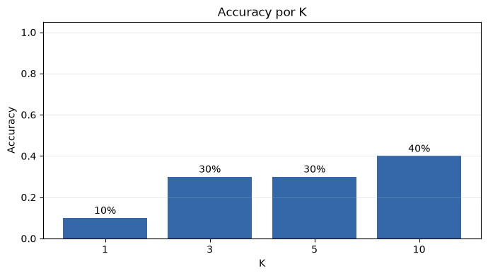
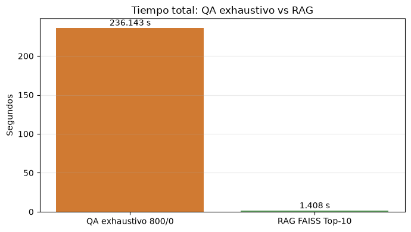
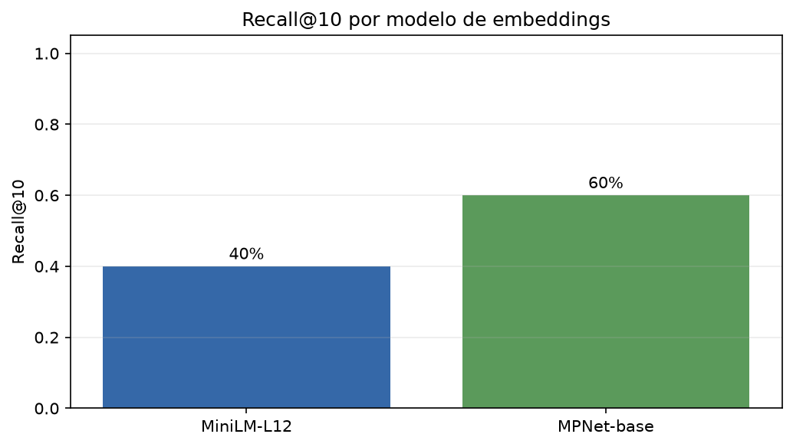
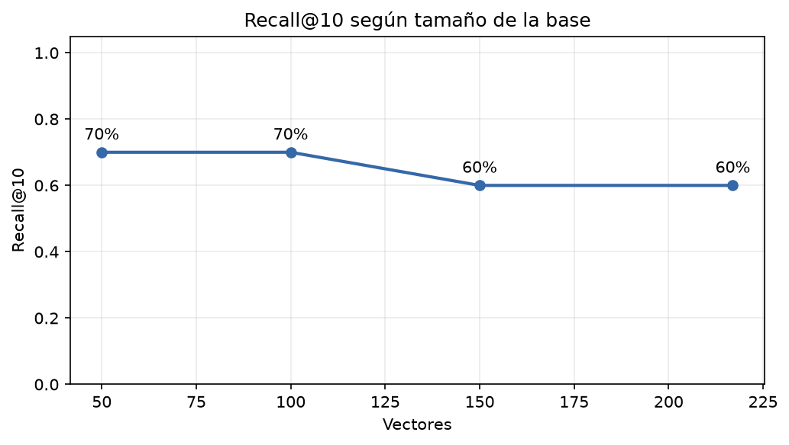

# Laboratorio 2 — Question Answering y Retrieval-Augmented Generation

## Portada

**Universidad:** Universidad de El Salvador  
**Facultad:** Facultad de Ingeniería y Arquitectura  
**Escuela:** Escuela de Sistemas Informáticos  
**Curso:** Curso de Especialización en Machine Learning  
**Laboratorio:** Laboratorio 2

**Estudiantes:**

- Josias Abner Rivas Fuentes
- Elmer Edenilson Rosales Molina

**Catedrático:** Vladimir Dias  
**Fecha:** 14 de agosto de 2026  
**Repositorio:** https://github.com/abner-rivas/Laboratorio---ML.git

**Título recomendado:** *Laboratorio 2: Question Answering y Retrieval-Augmented Generation sobre documentación académica de la Universidad de El Salvador*.

## Resumen

Este laboratorio estudió un sistema de preguntas y respuestas extractivo en español y su extensión hacia una arquitectura de recuperación aumentada (*Retrieval-Augmented Generation*, RAG) aplicada a un documento institucional extenso. El desarrollo avanzó desde ejemplos controlados y análisis del score de confianza hasta la comparación de tres modelos QA, la evaluación de seis configuraciones de fragmentación, la recuperación semántica con FAISS y la selección experimental de un modelo de embeddings.

La comparación controlada de modelos utilizó tres contextos y cinco preguntas por contexto. **BETO-SQAC (MMG)**, correspondiente a `MMG/bert-base-spanish-wwm-cased-finetuned-sqac`, respondió correctamente las 15 preguntas, frente a 13 de 15 para cada una de las dos variantes BETO-SQuAD2. Por ello fue seleccionado como extractor de respuestas para las fases documentales. El documento fuente fue el *Reglamento de la Gestión Académico-Administrativa de la Universidad de El Salvador*: 62 páginas, 26 119 palabras aproximadas y 173 419 caracteres después de una limpieza conservadora.

El barrido exhaustivo de seis configuraciones mostró que los chunks de 800 caracteres sin solapamiento ofrecían el mejor compromiso dentro del criterio definido: 217 fragmentos, 4 respuestas correctas de 10, score QA promedio de 0.942767 y 236.143 s. Este resultado también mostró que una confianza alta sobre un span no garantiza que el contexto seleccionado sea pertinente. El RAG histórico con MiniLM y Top-10 mantuvo 4 de 10 respuestas correctas y Recall@10 de 40 %, pero redujo las inferencias QA de 2 170 a 100. Su tiempo fue 1.408 s, aunque la comparación temporal debe interpretarse con cautela porque el barrido exhaustivo quedó registrado en CPU y la etapa RAG posterior en CUDA.

La sustitución de MiniLM por `sentence-transformers/paraphrase-multilingual-mpnet-base-v2` elevó Recall@10 y accuracy de 40 % a 60 % sobre la base completa de 217 vectores. La configuración final quedó formada por BETO-SQAC, embeddings MPNet multilingües de 768 dimensiones, chunks de 800 caracteres, solapamiento cero, FAISS `IndexFlatIP` y Top-10. El resultado final fue 6 respuestas correctas de 10. Las conclusiones se limitan a un documento, diez preguntas y una ejecución temporal por configuración; por tanto, describen el comportamiento observado y no una superioridad general de los modelos evaluados.

**Palabras clave:** Question Answering, QA extractivo, RAG, BETO, embeddings, FAISS, chunking, recuperación semántica.

# 1. Introducción

Un sistema de *Question Answering* (QA) busca responder una pregunta formulada en lenguaje natural a partir de un contexto. En la modalidad extractiva utilizada en este laboratorio, la salida es un span localizado dentro del texto de entrada. El modelo no redacta una respuesta nueva: estima las posiciones inicial y final más probables y devuelve el fragmento comprendido entre ambas. Esta característica permite conservar una relación directa con la fuente, pero también restringe el sistema a información explícitamente presente en el contexto proporcionado.

La aplicación directa de QA funciona en textos breves, pero presenta dos dificultades al crecer el documento. Primero, los modelos BETO evaluados admiten como máximo 512 tokens entre pregunta y contexto, de modo que el reglamento completo no puede procesarse como una sola entrada. Segundo, dividir el texto y ejecutar QA sobre todos los fragmentos eleva el coste y favorece falsos positivos: si se elige el mayor score entre cientos de candidatos, un span extraído de un artículo irrelevante puede imponerse al fragmento documental correcto.

El laboratorio abordó estas dificultades de forma incremental. Se verificó el comportamiento básico del modelo, se analizó la estabilidad de las respuestas candidatas y se ensayó una regla de abstención. Después se compararon tres modelos QA bajo condiciones controladas. El modelo seleccionado se aplicó a seis estrategias de fragmentación del PDF. Finalmente, se incorporó recuperación semántica: cada chunk se representó mediante un embedding, FAISS recuperó los $K$ candidatos más próximos y BETO-SQAC extrajo la respuesta solamente de esos candidatos.

El informe presenta el trabajo como un experimento reproducible y no como una transcripción del notebook. Se distinguen los resultados históricos de la configuración definitiva, se separan score QA, Recall@K y accuracy, y se señalan los factores que limitan la interpretación de los tiempos. Esta separación es necesaria porque cada métrica responde a una pregunta diferente: la confianza estima la preferencia del extractor por un span; Recall@K comprueba si la recuperación entregó evidencia; y accuracy determina si la respuesta final satisface el criterio de evaluación.

# 2. Objetivos

## 2.1 Objetivo general

Diseñar y evaluar un sistema de preguntas y respuestas extractivo en español sobre contextos breves y un documento institucional extenso, incorporando recuperación semántica para reducir el espacio de búsqueda y analizando de forma separada calidad de respuesta, recuperación y coste computacional.

## 2.2 Objetivos específicos

- Comprender la entrada, la salida y las limitaciones de un modelo QA extractivo.
- Evaluar el efecto de solicitar varias respuestas candidatas mediante `top_k` y comprobar el comportamiento ante preguntas sin evidencia.
- Comparar tres modelos BETO ajustados para QA en español con entradas y criterios comunes.
- Definir un criterio explícito de corrección que tolere normalización, spans más amplios y variantes aceptables declaradas.
- Extraer, limpiar y fragmentar un PDF real conservando offsets y procedencia de página.
- Comparar seis combinaciones de tamaño de chunk y solapamiento en caracteres.
- Construir un recuperador semántico con embeddings normalizados y FAISS.
- Medir el efecto de $K$, del modelo de embeddings y del tamaño de la base vectorial.
- Identificar errores de recuperación, extracción y fragmentación sin usar el score como sustituto de la corrección.
- Seleccionar una configuración final únicamente a partir de los resultados ejecutados.

# 3. Fundamentos teóricos

## 3.1 Question Answering extractivo

El pipeline QA recibe una pregunta $q$ y un contexto $c$. El tokenizer convierte ambos textos en identificadores numéricos y prepara la secuencia para el Transformer. El modelo produce logits para el inicio y el final de la respuesta; el pipeline decodifica la combinación seleccionada y devuelve cuatro campos principales: `answer`, `score`, `start` y `end`.

El experimento utilizó modelos BERT/BETO ajustados para español. Es importante conservar esta identificación porque el modelo base realmente cargado fue `mrm8488/bert-base-spanish-wwm-cased-finetuned-spa-squad2-es`; no corresponde a RoBERTa-BNE. La corrección del nombre evita atribuir resultados a una arquitectura distinta de la ejecutada.

La naturaleza extractiva aporta trazabilidad a nivel de span, pero no garantiza pertinencia. Cuando una pregunta carece de respuesta, el modelo puede devolver tokens especiales o cualquier fragmento que maximice localmente sus logits. Por tanto, la mera presencia de una cadena de salida no demuestra que el sistema haya contestado.

## 3.2 Score de confianza, `top_k` y exactitud

El score QA expresa la confianza interna asignada al span dentro del contexto recibido. No es una medida de exactitud documental. En `src/funciones_qa.py`, los scores se etiquetan como altos desde 0.75, medios desde 0.40 y bajos por debajo de 0.40. Esta clasificación facilita la inspección, pero no convierte los umbrales en reglas universales.

En los ejemplos iniciales se usó además 0.40 como umbral experimental de abstención. La función segura recomienda revisión cuando la mejor salida queda por debajo de ese valor. El umbral permitió separar los casos de Python respaldados por contexto de las preguntas ajenas al texto, pero no fue calibrado sobre un conjunto de validación. En consecuencia, se interpreta como una decisión operativa del laboratorio.

El parámetro `top_k` del pipeline QA devuelve varias hipótesis de span. Debe distinguirse del Top-K del recuperador RAG. En el primer caso, las alternativas proceden de un mismo contexto; en el segundo, $K$ indica cuántos chunks recupera FAISS antes de ejecutar QA. Solicitar más spans ayuda a inspeccionar límites y redundancias, mientras que aumentar $K$ puede incorporar evidencia adicional a costa de más inferencias.

## 3.3 Documentos extensos y fragmentación

El documento se dividió en ventanas medidas en caracteres. Para un tamaño $L$ y solapamiento $O$, el desplazamiento entre inicios consecutivos fue:

$$
P = L - O.
$$

Cada fragmento conservó identificador, texto, offset inicial, offset final, página inicial y página final. La metadata permitió comprobar si el candidato ganador provenía de la página esperada y separar una respuesta léxicamente plausible de una respuesta documentalmente correcta.

El solapamiento busca reducir la pérdida de evidencia en los límites. Sin embargo, también aumenta el número de chunks, las inferencias y la repetición de contenido. Su utilidad no puede asumirse: debe observarse si mejora respuestas o Recall en relación con el coste añadido.

## 3.4 Recuperación semántica y FAISS

Se conserva la denominación RAG utilizada en el notebook, aunque la etapa de respuesta no es generativa: FAISS recupera contexto y BETO-SQAC extrae un span. Operativamente, el sistema combina recuperación semántica con QA extractivo. Cada chunk se transforma en un vector; los embeddings de documentos y preguntas se normalizaron con norma L2. El índice `IndexFlatIP` de FAISS ejecutó búsqueda exacta por producto interno. Para vectores normalizados $\hat{x}$ y $\hat{y}$:

$$
\hat{x}^{\mathsf{T}}\hat{y} = \cos(\hat{x},\hat{y}).
$$

Por ello, el valor de FAISS representa similitud coseno. El flujo experimental fue: generar embeddings de los chunks una vez, construir el índice, representar la pregunta, recuperar los $K$ fragmentos mejor posicionados, ejecutar BETO-SQAC sobre esos fragmentos y seleccionar el span con mayor score QA.

La similitud FAISS y el score QA no se combinaron. Esta decisión mantiene interpretables las dos etapas: FAISS determina relevancia relativa entre pregunta y fragmentos; BETO determina confianza sobre una respuesta dentro de cada fragmento recuperado.

# 4. Herramientas y tecnologías

## 4.1 Documento institucional

La fuente documental fue `data/documento_fuente.pdf`, identificada en `data/README.md` como el *Reglamento de la Gestión Académico-Administrativa de la Universidad de El Salvador*. El archivo es un PDF de 62 páginas con texto extraíble, por lo que no se aplicó OCR. El notebook registró las siguientes propiedades:

| Propiedad | Valor |
|---|---:|
| Páginas | 62 |
| Caracteres crudos | 177 390 |
| Caracteres después de limpieza | 173 419 |
| Palabras aproximadas | 26 119 |
| Páginas con texto | 62 |
| Páginas sin texto | 0 |
| Páginas con menos de 200 caracteres | 0 |
| Tamaño del archivo | 497 732 bytes |

La limpieza fue conservadora: eliminó caracteres de guion blando, recompuso palabras separadas por guiones de fin de línea, normalizó secuencias de espacios y retiró espacios periféricos. No resumió artículos ni sustituyó palabras. El texto limpio mantuvo la asociación con la página física.

## 4.2 Contextos de evaluación

Se emplearon cuatro grupos de entrada:

1. Ejemplos breves sobre el Sistema Solar, Inteligencia Artificial y Python para verificar el pipeline, `top_k` y preguntas sin respuesta.
2. Un contexto propio de Inteligencia Artificial y Machine Learning con 308 palabras y diez preguntas.
3. Tres contextos de cinco preguntas cada uno para comparar modelos: Universidad de El Salvador, Bases de Datos y SGBD, y un extracto adaptado de Wikipedia sobre aprendizaje automático.
4. Diez preguntas distribuidas a lo largo del reglamento, con respuesta esperada, artículo, página y evidencia textual declarados antes de evaluar RAG.

Las preguntas documentales incluyeron tres fáciles, cuatro intermedias, dos difíciles y una diseñada para inspeccionar un límite de fragmento. La cobertura abarcó las páginas 3, 4, 15, 20, 30, 40, 45, 50 y 62. Esta dispersión permitió comprobar recuperación en zonas distintas del PDF, aunque no constituye una muestra estadística amplia.

## 4.3 Software y reproducibilidad

`requirements.txt` declara `transformers`, `torch`, `sentence-transformers`, `faiss-cpu`, `pandas`, `numpy`, `matplotlib`, `PyMuPDF`, `huggingface-hub` y `pytest`. El notebook indica Python 3.10 o superior y fue ejecutado en entornos Jupyter o equivalentes.

| Herramienta | Función principal |
|---|---|
| Transformers y PyTorch | Tokenización, carga y ejecución de los modelos QA. |
| Sentence Transformers | Embeddings de chunks y preguntas. |
| FAISS | Índice vectorial y recuperación Top-K. |
| PyMuPDF | Extracción de texto del PDF. |
| Pandas y NumPy | Tablas, agregaciones y operaciones numéricas. |
| Matplotlib | Gráficos experimentales. |
| Hugging Face Hub | Identificación y carga de modelos. |
| Pytest | Validación de metadata, métricas y clasificación de errores desde la raíz del repositorio. |

Las dependencias no están fijadas a versiones concretas. Esta omisión limita la reproducción exacta de tokenización, tiempos y comportamiento de bibliotecas. El notebook ejecutado conserva, no obstante, los resultados experimentales finales y los CSV reúnen los registros consolidados. `results/resultados_qa.csv` contiene el detalle de la comparación QA y los resúmenes de las fases posteriores; `results/comparacion_modelos.csv` conserva el agregado de los tres modelos.

# 5. Desarrollo de Question Answering

## 5.1 Modelos QA comparados

Se evaluaron tres identificadores de Hugging Face:

- **BETO-SQuAD2 (mrm8488):** `mrm8488/bert-base-spanish-wwm-cased-finetuned-spa-squad2-es`.
- **BETO-SQuAD2 (MMG):** `MMG/bert-base-spanish-wwm-cased-finetuned-squad2-es`.
- **BETO-SQAC (MMG):** `MMG/bert-base-spanish-wwm-cased-finetuned-sqac`.

En la comparación controlada, cada modelo respondió las mismas cinco preguntas de cada contexto, con `top_k=1`, lógica de inferencia común y CPU. El tiempo de carga se midió aparte. Antes de cronometrar se realizó una inferencia de calentamiento, y cada modelo se liberó antes de cargar el siguiente.

El ranking por contexto y el global priorizaron, en orden, respuestas correctas, spans exactos, score y tiempo. Esta jerarquía evitó seleccionar un modelo únicamente porque asignara scores más altos a sus propias salidas.

## 5.2 Criterio de corrección

La evaluación normalizó ambas respuestas mediante minúsculas, eliminación de diacríticos y signos, y compactación de espacios. Después aplicó las siguientes reglas:

1. Igualdad exacta tras normalización.
2. Presencia completa de la respuesta esperada dentro de un span más amplio.
3. Comparación léxica entre los conjuntos de tokens de la respuesta obtenida $M$ y la esperada $E$.

La cobertura y la precisión léxicas se definieron como:

$$
\operatorname{cobertura} = \frac{|M \cap E|}{|E|},
\qquad
\operatorname{precision} = \frac{|M \cap E|}{|M|}.
$$

Una variante se aceptó automáticamente cuando la cobertura fue al menos 0.80 y la precisión al menos 0.60. Una cobertura desde 0.60 se marcó como respuesta parcial. Además, algunas preguntas incluyeron variantes aceptables explícitas antes de la ejecución; cuando una de ellas coincidió, el registro quedó identificado como revisión manual explícita. De este modo, la revisión no alteró respuestas, scores ni tiempos, y su intervención permaneció visible.

## 5.3 Métricas

Para $N$ preguntas, la exactitud agregada se calculó como:

$$
\operatorname{Accuracy} = \frac{\text{respuestas correctas}}{N}.
$$

En recuperación, una pregunta se consideró recuperada si al menos un chunk del Top-K contenía la evidencia anotada y cubría la página objetivo. La métrica fue:

$$
\operatorname{Recall@K} =
\frac{\text{preguntas con evidencia en Top-K}}{N}.
$$

También se registraron score QA promedio, tiempo total y promedio, número de chunks, número de inferencias, dimensión de embeddings, tiempo de embeddings y tiempo de construcción del índice. Los tiempos representan una ejecución, no distribuciones con repeticiones.

## 5.4 Evaluación del PDF mediante QA exhaustivo

BETO-SQAC se ejecutó sobre todos los chunks para cada una de las diez preguntas. Los contextos se procesaron en lotes de 24, con el modelo en modo de evaluación y sin cálculo de gradientes. Para cada pregunta se conservó el span con mayor score entre todos los fragmentos.

Se compararon seis configuraciones, todas expresadas en caracteres: 300/0, 300/50, 500/0, 500/100, 800/0 y 800/150, donde la primera cifra es el tamaño y la segunda el solapamiento. Los solapamientos equivalen aproximadamente a 16.7 %, 20 % y 18.75 % de sus respectivos tamaños.

El criterio de selección priorizó correctas, score promedio, score mediano, menor tiempo y menor número de chunks. El score se incluyó después de la corrección, no como reemplazo de ella.

## 5.5 RAG histórico con MiniLM

La primera etapa RAG reutilizó los chunks seleccionados de 800 caracteres sin solapamiento. `sentence-transformers/paraphrase-multilingual-MiniLM-L12-v2` produjo 217 vectores de 384 dimensiones. La matriz fue normalizada y se indexó una sola vez con `IndexFlatIP`.

Se evaluaron $K=1,3,5,10$ con las mismas diez preguntas y el mismo extractor BETO-SQAC. Al cambiar $K$ no se regeneraron embeddings ni se reconstruyó el índice. El coste de consulta incluyó el embedding de la pregunta, la búsqueda y QA sobre los candidatos, pero excluyó la preparación inicial de la matriz y el índice.

## 5.6 Selección del RAG final

La fase final mantuvo fijos el PDF, las diez preguntas, BETO-SQAC, los 217 chunks 800/0 y Top-10. Comparó dos modelos de embeddings:

- MiniLM multilingüe, 384 dimensiones.
- MPNet multilingüe, 768 dimensiones.

Para cada modelo se regeneraron los 217 embeddings y se construyó un índice independiente. Se midieron por separado embeddings, indexación y diez consultas completas. El ranking jerárquico priorizó correctas, Recall@10, tiempo de consultas y tiempo de embeddings.

Después se estudió el tamaño de la base con el modelo ganador. Se localizaron 11 chunks únicos necesarios para representar la evidencia de las diez preguntas; la pregunta 10 requirió dos chunks adyacentes. Todas las bases conservaron esos chunks obligatorios y se completaron con distractores según una permutación reproducible con semilla 42. Las bases de 50, 100, 150 y 217 vectores fueron anidadas. Este diseño evitó confundir un fallo de ranking con la eliminación deliberada de la evidencia.

# 6. Experimentos iniciales

## 6.1 Respuestas candidatas y estabilidad

En las tres preguntas del Sistema Solar, el candidato de rango 1 permaneció estable al variar `top_k` entre 1, 3 y 5. Con cinco candidatos, la caída media entre el primero y el último score fue 0.6266. De 18 alternativas examinadas, 17 contenían el mejor span o estaban contenidas en él. Por tanto, las respuestas adicionales fueron principalmente expansiones o recortes redundantes, no soluciones semánticamente distintas.

El caso de Júpiter ilustra el patrón: el primer candidato fue «jupiter» con score 0.6399; los siguientes ampliaron el span y descendieron hasta 0.0069. El incremento de `top_k` hizo visible la incertidumbre sobre los límites, pero no cambió la mejor respuesta.

## 6.2 Preguntas sin evidencia y regla de abstención

Sobre el contexto de Python, las preguntas respaldadas obtuvieron scores de 0.9700 para «Guido van Rossum» y 0.8396 para «1991». Las preguntas sobre la capital de Francia y el creador de Java, ausentes del contexto, devolvieron tokens especiales o información no pertinente con scores máximos de 0.0013 y 0.0395.

Este contraste justificó la regla experimental de abstención en 0.40. Sin embargo, los resultados posteriores muestran que una respuesta correcta también puede tener score bajo. El umbral sirve para marcar casos de revisión, no para establecer automáticamente la verdad de la respuesta.

## 6.3 Actividad sobre contexto propio

El contexto propio tuvo 308 palabras y diez preguntas. La evaluación combinó normalización con revisiones explícitas. El modelo base BETO-SQuAD2 (mrm8488) obtuvo 10 respuestas correctas, score medio de 0.631570, tiempo total de 1.7577 s y promedio de 0.17577 s por pregunta.

| Pregunta | Dificultad | Score | Correcta | Tipo de resultado |
|---:|---|---:|:---:|---|
| 1 | Fácil | 0.874933 | Sí | Exacta tras normalización |
| 2 | Intermedia | 0.637630 | Sí | Exacta tras normalización |
| 3 | Fácil | 0.787396 | Sí | Exacta tras normalización |
| 4 | Fácil | 0.929076 | Sí | Exacta tras normalización |
| 5 | Intermedia | 0.251790 | Sí | Parcial aceptada por revisión explícita |
| 6 | Intermedia | 0.537380 | Sí | Respuesta incluida en un span más amplio |
| 7 | Relación | 0.490008 | Sí | Variante textual correcta |
| 8 | Intermedia | 0.354680 | Sí | Variante textual correcta |
| 9 | Relación | 0.741229 | Sí | Exacta tras normalización |
| 10 | Difícil | 0.711581 | Sí | Exacta tras normalización |

Los scores variaron entre 0.251790 y 0.929076. La pregunta 5 fue correcta con el menor score: el modelo respondió «en dispositivos periféricos» y omitió la expresión «mediante edge computing». La pregunta 6 añadió «y producir decisiones injustas» al núcleo «sesgo». Estos casos confirman que el principal problema no siempre es localizar el concepto, sino fijar los límites exactos del span. También muestran por qué la exactitud no debe inferirse directamente de la confianza.

# 7. Comparación de modelos QA

## 7.1 Resultados por contexto

La tabla siguiente resume 45 inferencias: cinco preguntas, tres contextos y tres modelos. Todos los tiempos corresponden a inferencia en CPU y excluyen carga.

| Contexto | Modelo | Correctas | Exactas | Score medio | Tiempo medio (s) |
|---|---|---:|---:|---:|---:|
| UES | BETO-SQuAD2 (mrm8488) | 4/5 | 3 | 0.639995 | 0.0620 |
| UES | BETO-SQuAD2 (MMG) | 5/5 | 5 | 0.536869 | 0.0630 |
| UES | BETO-SQAC (MMG) | 5/5 | 2 | 0.615832 | 0.0612 |
| Bases de datos | BETO-SQuAD2 (mrm8488) | 4/5 | 2 | 0.436674 | 0.1833 |
| Bases de datos | BETO-SQuAD2 (MMG) | 4/5 | 2 | 0.329666 | 0.1774 |
| Bases de datos | BETO-SQAC (MMG) | 5/5 | 3 | 0.778458 | 0.1818 |
| Wikipedia adaptada | BETO-SQuAD2 (mrm8488) | 5/5 | 4 | 0.546924 | 0.1192 |
| Wikipedia adaptada | BETO-SQuAD2 (MMG) | 4/5 | 4 | 0.408166 | 0.0992 |
| Wikipedia adaptada | BETO-SQAC (MMG) | 5/5 | 4 | 0.681568 | 0.1033 |

En el contexto UES, BETO-SQuAD2 (MMG) fue el único modelo con cinco respuestas exactas. BETO-SQAC también respondió las cinco, pero amplió algunos spans o requirió la variante explícita «Ingeniería y Arquitectura». En bases de datos, BETO-SQAC fue el único con 5/5. Los otros modelos fallaron, respectivamente, la definición del SGBD y la descripción completa del modelo relacional. En Wikipedia, BETO-SQuAD2 (MMG) redujo la respuesta sobre aprendizaje por refuerzo a «retroalimentación», mientras que los otros dos modelos obtuvieron 5/5.



La figura muestra que las diferencias temporales del contexto inicial fueron pequeñas y que el mayor score medio no determinó por sí solo el número de respuestas correctas. La evaluación global necesitó incorporar los otros dos dominios.

## 7.2 Agregado global y selección

| Modelo | Correctas | Exactas | Accuracy | Score medio global | Tiempo medio global (s) |
|---|---:|---:|---:|---:|---:|
| BETO-SQuAD2 (mrm8488) | 13/15 | 9 | 86.67 % | 0.541198 | 0.1215 |
| BETO-SQuAD2 (MMG) | 13/15 | 11 | 86.67 % | 0.424900 | 0.1132 |
| BETO-SQAC (MMG) | 15/15 | 9 | 100 % | 0.691953 | 0.1154 |

El ganador cambió por dominio: BETO-SQuAD2 (MMG) encabezó el contexto UES y BETO-SQAC los otros dos. En el agregado, BETO-SQAC respondió correctamente las 15 preguntas y obtuvo el mayor score medio global. Aunque no produjo la mayor cantidad de spans exactos ni fue el más rápido, cumplió el criterio prioritario de corrección en todos los contextos. Por esa razón fue seleccionado para el documento extenso, chunking y RAG.

La comparación también muestra que el score y la latencia dependen del dominio. BETO-SQAC pasó de un score promedio de 0.615832 en UES a 0.778458 en bases de datos y 0.681568 en Wikipedia; el tiempo medio varió de 0.0612 s a 0.1818 s y 0.1033 s. No es adecuado extrapolar una única cifra de confianza o velocidad a textos con características distintas.

# 8. Question Answering sobre documentos extensos

## 8.1 Configuración base 500/0

La configuración inicial de 500 caracteres sin solapamiento produjo 347 chunks. La longitud media fue 499.77 caracteres, la máxima 500 y el máximo observado fue 158 tokens, por debajo del límite total del modelo al añadir la pregunta.

El barrido exhaustivo obtuvo 3/10 respuestas correctas, score promedio de 0.917160, mediana de 0.945109 y 223.805 s. Los aciertos fueron las preguntas 4, 5 y 7, aunque la procedencia reveló un matiz: la respuesta «la Junta Directiva» de la pregunta 7 apareció en un chunk de la página 45 y no en la página 50 del artículo 207. La evaluación textual la aceptó, pero la metadata mostró que no era la evidencia documental esperada.

Los seis errores restantes presentaron scores elevados. Por ejemplo, la pregunta 1 produjo «cada mes» con 0.983650 desde la página 11, pese a que se esperaba «una vez al mes» en la continuación del artículo 6, página 3. Este comportamiento anticipó la necesidad de recuperar contexto por relevancia antes de aplicar QA.

# 9. Evaluación de chunking y overlap

## 9.1 Comparación de seis configuraciones

| Configuración | Chunks | Correctas | Accuracy | Score medio | Mediana | Tiempo total (s) |
|---|---:|---:|---:|---:|---:|---:|
| 300/0 | 579 | 3/10 | 30 % | 0.935121 | 0.941873 | 288.147 |
| 300/50 | 694 | 4/10 | 40 % | 0.915775 | 0.916012 | 350.798 |
| 500/0 | 347 | 3/10 | 30 % | 0.917160 | 0.945109 | 223.805 |
| 500/100 | 434 | 4/10 | 40 % | 0.938941 | 0.952259 | 325.274 |
| 800/0 | 217 | 4/10 | 40 % | 0.942767 | 0.947314 | 236.143 |
| 800/150 | 267 | 4/10 | 40 % | 0.898146 | 0.923997 | 282.039 |

Con 300 caracteres, agregar 50 de overlap aumentó los aciertos en uno, añadió 115 chunks y 62.650 s, y redujo el score medio en 0.019346. Con 500 caracteres, un overlap de 100 añadió un acierto, 87 chunks y 101.469 s, mientras elevó el score medio en 0.021781. Con 800 caracteres, un overlap de 150 no cambió los cuatro aciertos, añadió 50 chunks y 45.897 s, y redujo el score medio en 0.044622.

Los resultados no respaldan una ventaja uniforme del solapamiento. Ayudó a la accuracy en dos tamaños, pero no en 800 caracteres, y siempre aumentó el coste. La configuración 500/100 obtuvo la mayor mediana, 0.952259, pero procesó el doble de fragmentos que 800/0 y necesitó 325.274 s.

## 9.2 Pregunta cercana al límite

La pregunta 10 buscaba «un año académico más» en el artículo 184. Ninguna configuración la respondió correctamente. En 300/50, el chunk ganador llegó a la página 45, pero el modelo extrajo «tres años». En las otras cinco variantes dominó «dos años» desde la página 43 o un contexto igualmente incorrecto.

Este caso no demostró que el overlap recuperara el span esperado. La evidencia estaba cerca de cortes reales de 500 y 800 caracteres, pero otros candidatos alcanzaron scores mayores. En la inspección posterior de los chunks 800/0 se comprobó que la evidencia de la pregunta 10 quedaba repartida entre los fragmentos 155 y 156. La limitación no fue solamente el ranking: ningún chunk individual contenía la frase completa en esa configuración.

## 9.3 Configuración seleccionada

Entre las cuatro configuraciones con 4/10, 800/0 tuvo el mayor score promedio, el menor tiempo y la menor cantidad de chunks. Fue seleccionada con 217 ventanas, sin solapamiento. La decisión no implica que 800 caracteres sea un valor universal; identifica el mejor compromiso del conjunto evaluado y determina las condiciones comunes para las fases RAG.

# 10. Sistema RAG con embeddings y FAISS

## 10.1 Construcción de la base vectorial

MiniLM generó una matriz de forma $(217,384)$ con un vector normalizado por chunk. En la ejecución inicial, la generación de embeddings tardó 0.595 s y la construcción del índice exacto 0.000306 s. Estos costes ocurrieron una vez y se excluyeron al comparar consultas para distintos valores de $K$.

La recuperación mantuvo rank, similitud, chunk, páginas y una muestra textual. BETO-SQAC se aplicó en lote sobre los chunks recuperados y seleccionó exclusivamente por score QA. En el ensayo inicial con $K=3$ se obtuvieron 3/10 respuestas correctas.

# 11. Evaluación de Top-K

## 11.1 Efecto de Top-K

| K | Correctas | Accuracy | Recall@K | Score QA medio | Tiempo total (s) |
|---:|---:|---:|---:|---:|---:|
| 1 | 1/10 | 10 % | 10 % | 0.269381 | 0.189 |
| 3 | 3/10 | 30 % | 30 % | 0.640720 | 0.508 |
| 5 | 3/10 | 30 % | 30 % | 0.702736 | 0.721 |
| 10 | 4/10 | 40 % | 40 % | 0.836432 | 1.408 |



La figura muestra la mejora de 10 % a 40 % al pasar de uno a diez candidatos. Entre $K=3$ y $K=5$ no cambió la accuracy ni el Recall, aunque el tiempo creció. Top-10 fue el único valor con cuatro aciertos y se seleccionó para la comparación histórica, con un máximo de 100 inferencias QA para diez preguntas.

El aumento simultáneo de Recall y accuracy indica que, en esta ejecución, la calidad final estaba limitada por la entrada de evidencia al Top-K. No obstante, el tiempo creció de 0.189 s a 1.408 s porque BETO recibió más contextos.

# 12. Baseline exhaustivo frente a RAG

## 12.1 Comparación ejecutada

| Método | Chunks QA por pregunta | Correctas | Accuracy | Score QA medio | Tiempo total (s) | Inferencias QA |
|---|---:|---:|---:|---:|---:|---:|
| QA exhaustivo 800/0 | 217 | 4/10 | 40 % | 0.942767 | 236.143 | 2 170 |
| RAG MiniLM Top-10 | 10 | 4/10 | 40 % | 0.836432 | 1.408 | 100 |

El RAG histórico mantuvo la misma accuracy agregada con 2 070 inferencias menos, una reducción de 95.4 %. La razón entre los tiempos registrados fue $236.143/1.408 = 167.75$. La preparación inicial de MiniLM, 0.595 s, y del índice, 0.000306 s, no entró en ese cociente.



La diferencia visual es considerable, pero no puede atribuirse por completo a la recuperación. La etapa de chunking exhaustivo registró `cpu`, mientras que la carga de la fase RAG posterior registró `cuda`. El número de inferencias demuestra una reducción estructural independiente del dispositivo; el speedup temporal mezcla esa reducción con un cambio de hardware y debe conservarse como resultado de ejecución, no como estimación aislada del efecto de FAISS.

# 13. Análisis de errores

## 13.1 Clasificación observada

En MiniLM Top-10, las preguntas con evidencia recuperada fueron 1, 3, 4 y 7; esas mismas cuatro resultaron correctas. De los seis fallos, cinco se clasificaron como `error_recuperacion` y uno como `chunking`. No se observaron errores atribuibles exclusivamente al extractor, respuestas parciales, ambigüedad o evaluación bajo la precedencia definida.

| Causa | Casos |
|---|---:|
| Evidencia no recuperada en Top-10 | 5 |
| Evidencia dividida por chunking | 1 |
| Error de QA con evidencia recuperada | 0 |
| Respuesta parcial | 0 |
| Error de evaluación | 0 |

Esta clasificación explica por qué Recall@10 y accuracy coincidieron en 40 %. En esa ejecución, BETO respondió correctamente siempre que recibió un chunk con la evidencia completa. El principal cuello de botella estaba en la recuperación, seguido por la evidencia que cruzaba un límite de ventana.

# 14. Experimentos adicionales

## 14.1 MiniLM frente a MPNet

| Modelo | Dimensión | Recall@10 | Correctas | Accuracy | Score QA medio | Embeddings (s) | Consultas (s) |
|---|---:|---:|---:|---:|---:|---:|---:|
| MiniLM-L12 multilingüe | 384 | 40 % | 4/10 | 40 % | 0.836432 | 0.536 | 1.432 |
| MPNet-base multilingüe | 768 | 60 % | 6/10 | 60 % | 0.861635 | 1.642 | 1.420 |

MPNet elevó Recall@10 y accuracy en 20 puntos porcentuales. El tiempo de diez consultas fue prácticamente igual en esta ejecución, pero generar los embeddings de MPNet costó 3.06 veces el tiempo de MiniLM. La indexación fue inferior a 0.0001 s para ambos modelos: 0.000080 s con MiniLM y 0.000074 s con MPNet.



La figura resume la mejora de recuperación que sustentó la selección. No permite afirmar que una dimensión mayor sea la causa general del resultado; solo muestra que MPNet superó a MiniLM con estos 217 chunks y diez preguntas. El criterio jerárquico eligió MPNet porque mejoró primero correctas y Recall, aun con mayor coste de preparación.

## 14.2 Tamaño de la base vectorial

Las cuatro bases incluyeron 11 chunks obligatorios únicos. La base de 50 añadió 39 distractores; las de 100, 150 y 217 añadieron 89, 139 y 206. La evidencia anotada de las diez preguntas permaneció disponible en todas las bases.

| Vectores | Distractores | Recall@10 | Correctas | Accuracy | Score QA medio | Índice (s) | Consultas (s) |
|---:|---:|---:|---:|---:|---:|---:|---:|
| 50 | 39 | 70 % | 5/10 | 50 % | 0.810820 | 0.000039 | 1.408 |
| 100 | 89 | 70 % | 6/10 | 60 % | 0.786065 | 0.000138 | 1.410 |
| 150 | 139 | 60 % | 6/10 | 60 % | 0.832562 | 0.000071 | 1.403 |
| 217 | 206 | 60 % | 6/10 | 60 % | 0.861635 | 0.000091 | 1.412 |



Recall@10 fue 70 % con 50 y 100 vectores, y 60 % con 150 y 217. La accuracy no siguió exactamente esa secuencia: fue 50 % en la base más pequeña y 60 % en las tres restantes. Entre 50 y 217 vectores, Recall disminuyó 10 puntos, accuracy aumentó 10 puntos y el tiempo de diez consultas creció aproximadamente 0.005 s.

Debido a que la evidencia nunca se eliminó, la reducción de Recall al añadir vectores representa competencia de ranking frente a distractores. El coste de búsqueda exacta se mantuvo por debajo de 0.001 s; el componente dominante siguió siendo BETO sobre diez contextos. La amplitud temporal entre las cuatro ejecuciones fue solo 0.010 s y no permite establecer una tendencia de escalabilidad.

# 15. Configuración final

## 15.1 Componentes y resultado

| Componente | Selección final |
|---|---|
| Documento | Reglamento académico-administrativo de la UES |
| Modelo QA | BETO-SQAC (MMG) |
| Modelo de embeddings | MPNet-base multilingüe |
| Dimensión | 768 |
| Tamaño de chunk | 800 caracteres |
| Solapamiento | 0 caracteres |
| Índice | FAISS `IndexFlatIP` |
| Fragmentos indexados | 217 |
| Fragmentos recuperados | Top-10 |
| Resultado | 6/10 correctas; 60 % de accuracy |
| Recuperación | Recall@10 de 60 % |

La selección final alcanzó 6/10 respuestas correctas y Recall@10 de 60 %. En la comparación directa de embeddings, las diez consultas tardaron 1.420 s; al volver a evaluar la base completa dentro del experimento de tamaños, tardaron 1.412 s. La diferencia refleja ejecuciones distintas de la misma configuración y no modifica la selección.

# 16. Hallazgos

## 16.1 El score QA no sustituye la evaluación

La evidencia más clara aparece en el QA exhaustivo 800/0: score promedio de 0.942767 con solo 40 % de accuracy. Al comparar 217 fragmentos por pregunta, el máximo favoreció spans seguros dentro de artículos no relacionados. RAG MiniLM redujo el score medio a 0.836432 sin cambiar la accuracy de 40 %. Por tanto, un score menor no representó un sistema peor; reflejó un conjunto de contextos distinto.

Los contextos breves presentan el fenómeno complementario. En la actividad propia, las preguntas 5 y 8 fueron aceptadas con scores de 0.251790 y 0.354680. En la comparación de modelos, varias respuestas exactas de BETO-SQuAD2 (MMG) tuvieron score bajo. Un umbral puede ayudar a priorizar revisión, pero clasificar la respuesta exige comparar contenido y evidencia.

## 16.2 La selección del extractor dependió del dominio

Ningún modelo dominó todos los criterios locales. BETO-SQuAD2 (MMG) produjo más spans exactos globales y el menor tiempo promedio, pero falló dos preguntas. BETO-SQAC tuvo menos spans exactos que ese modelo, aunque respondió correctamente las 15. La elección priorizó suficiencia semántica sobre coincidencia literal y velocidad marginal.

El cambio de ganador entre UES y los otros contextos muestra que una prueba de una sola pregunta habría sido insuficiente. La progresión desde una comparación preliminar hacia tres dominios controlados permitió tomar una decisión más defendible para la fase documental.

## 16.3 El solapamiento fue un compromiso, no una mejora garantizada

El overlap mejoró un acierto en 300/50 y 500/100, pero no en 800/150. En todos los casos aumentó chunks y tiempo. Además, la pregunta de límite continuó fallando. Estos resultados justificaron conservar 800/0, aun sabiendo que la evidencia de una pregunta quedaba dividida.

La decisión favoreció eficiencia y rendimiento agregado, pero dejó una limitación estructural: BETO procesa un fragmento por vez y no puede recomponer evidencia repartida entre ventanas adyacentes. El experimento de tamaño tuvo que conservar ambos chunks de la pregunta 10 para asegurar que el conocimiento permaneciera en la base, sin que ello garantizara una respuesta correcta.

## 16.4 La recuperación determinó el techo del sistema

Con MiniLM Top-10, los conjuntos de preguntas recuperadas y correctas coincidieron. Cinco fallos se debieron a que la evidencia no llegó al extractor y uno al chunking. El cambio a MPNet elevó Recall y accuracy en la misma magnitud, de 40 % a 60 %. Esta correspondencia respalda, para esta muestra, que mejorar la representación semántica fue más efectivo que modificar nuevamente BETO.

Sin embargo, Recall y accuracy no son equivalentes en general. El experimento de tamaño lo demuestra: 50 vectores alcanzaron 70 % de Recall pero solo 50 % de accuracy, mientras que 217 vectores obtuvieron 60 % en ambas métricas. Tener evidencia entre los diez candidatos es una condición útil, pero el extractor aún debe seleccionar el span correcto y competir con otros contextos.

## 16.5 Efecto de los distractores

Las bases anidadas preservaron toda la evidencia y variaron únicamente el número de distractores. El descenso de Recall al crecer de 100 a 150 vectores indica que algunos chunks pertinentes perdieron posiciones frente a candidatos semánticamente similares. La base completa no empeoró la accuracy respecto de 100, pero tampoco aumentó el Recall.

No se concluye que reducir la base sea universalmente preferible. La base de 50 fue construida de forma controlada con todos los chunks de evidencia, condición que no existe en una colección desconocida. El resultado sirve para aislar la competencia del ranking, no para proponer eliminar documentos antes de conocer las consultas.

## 16.6 Eficiencia computacional

La reducción de 2 170 a 100 inferencias QA es la ventaja estructural más clara del RAG histórico. FAISS tuvo un tiempo de indexación despreciable a esta escala y el coste de embeddings pudo amortizarse entre consultas. Mantener Top-10 fija también explica por qué el tamaño de la base apenas cambió el tiempo: BETO procesó como máximo diez contextos en todos los casos.

La comparación temporal directa entre QA exhaustivo y RAG no fue controlada por dispositivo. Por ello, el speedup de $167.75\times$ describe la ejecución registrada, mientras que la reducción de 95.4 % en inferencias describe el cambio algorítmico. Una evaluación posterior debería ejecutar ambos métodos en el mismo hardware y repetir cada configuración.

# 17. Limitaciones y trabajo futuro

## 17.1 Validez interna

- Los tiempos proceden de una sola ejecución por configuración. No se calcularon desviaciones, intervalos ni repeticiones, de modo que diferencias de milisegundos pueden corresponder a ruido del sistema.
- La comparación de modelos QA y el barrido exhaustivo registraron CPU, mientras que la etapa RAG posterior registró CUDA. Esto impide aislar el efecto del recuperador en el speedup temporal entre ambas fases.
- El tiempo de carga se separó en la comparación QA y el coste de embeddings e índice se excluyó de las consultas RAG. Estas decisiones son explícitas, pero obligan a interpretar cada columna según su alcance.
- Las revisiones manuales usaron variantes declaradas y quedaron etiquetadas. Aun así, aceptar respuestas parciales semánticamente suficientes introduce juicio humano en algunos casos.
- El criterio jerárquico de selección incorporó score después de correctas y exactas. Dado que el score no está calibrado como accuracy, solo debe entenderse como criterio de desempate dentro de esta ejecución.

## 17.2 Validez externa

- La fase documental utilizó un único PDF institucional y diez preguntas. No se evaluaron otros géneros, longitudes, calidades de extracción ni distribuciones de consultas.
- Los tres modelos QA pertenecen a la familia BETO en español. Los resultados no comparan arquitecturas generativas ni modelos de otros tamaños.
- Solo se compararon dos modelos de embeddings y un índice exacto `IndexFlatIP`. No se evaluaron reordenadores, búsqueda híbrida, índices aproximados ni combinación de scores.
- La base vectorial más pequeña fue construida preservando evidencia conocida. Ese diseño es válido para estudiar distractores, pero no representa una colección reducida sin anotaciones previas.
- El umbral 0.40 se eligió de manera experimental y no fue calibrado para el reglamento ni para un entorno de producción.

## 17.3 Reproducibilidad

- `requirements.txt` no fija versiones. Cambios en Transformers, PyTorch, Sentence Transformers o tokenizers pueden modificar resultados y tiempos.
- Los modelos se identifican mediante nombres de repositorio, pero no se registran revisiones o hashes concretos.
- La semilla 42 controla la selección anidada de distractores, pero no convierte las mediciones temporales en deterministas.
- Los CSV conservan resultados consolidados, mientras que el notebook ejecutado preserva tablas, salidas y decisiones. Ante diferencias con texto histórico, las salidas finales y los DataFrames ejecutados constituyen la referencia experimental.

## 17.4 Trabajo futuro

Después de la extensión multidocumento, las líneas siguientes permanecen abiertas y deberán someterse a experimentos nuevos:

- repetir baseline y RAG en el mismo dispositivo, con varias mediciones y dispersión;
- fijar versiones de dependencias y revisiones de modelos;
- ampliar la evaluación más allá de las 18 preguntas, 9 documentos y 2 casos sin respuesta actuales;
- calibrar la abstención con datos de validación del dominio;
- comparar chunking semántico, recuperación por artículo y overlap adaptativo;
- recomponer chunks adyacentes cuando la evidencia cruce un límite;
- evaluar recuperación híbrida BM25–embeddings y reranking;
- enriquecer la metadata actual de documento, título y página con capítulo y artículo estructurados;
- incorporar nDCG después de definir grados de relevancia; MRR ya se reporta para documento y chunk;
- diseñar una evaluación humana y, como extensión separada, una interfaz de consulta.

# 18. Conclusiones

1. **Mejor modelo QA.** BETO-SQAC (MMG), identificado como `MMG/bert-base-spanish-wwm-cased-finetuned-sqac`, fue el mejor extractor del conjunto evaluado.

2. **Razón de la selección.** Obtuvo 15/15 respuestas correctas en tres contextos, frente a 13/15 para cada BETO-SQuAD2. La decisión priorizó corrección antes de spans exactos, score o tiempo.

3. **Tamaño de chunk.** Se seleccionaron 800 caracteres porque la variante 800/0 empató con el mayor número de aciertos, utilizó 217 chunks y ofreció el mejor compromiso de la fase.

4. **Efecto del overlap.** El solapamiento mejoró un acierto en 300/50 y 500/100, pero no en 800/150; siempre aumentó chunks y coste. Por ello, el overlap final fue cero.

5. **Efecto de Top-K.** Con MiniLM, aumentar $K$ de 1 a 10 elevó accuracy y Recall de 10 % a 40 %, a costa de pasar de 0.189 s a 1.408 s. Se seleccionó Top-10 entre los valores ejecutados.

6. **Resultado de MiniLM.** El RAG histórico con MiniLM Top-10 obtuvo 4/10, 40 % de accuracy y 40 % de Recall@10. No mejoró el baseline en precisión, pero restringió el espacio de QA.

7. **Mejora de MPNet.** MPNet elevó accuracy y Recall@10 de 40 % a 60 %, aunque generar sus embeddings tardó 3.06 veces más que con MiniLM.

8. **Aporte de FAISS.** `IndexFlatIP` permitió recuperar diez candidatos mediante producto interno sobre vectores normalizados y evitar el barrido QA de la mayoría de los chunks. FAISS recuperó contexto; no generó ni evaluó la respuesta final.

9. **Reducción de coste.** El RAG histórico redujo las inferencias QA de 2 170 a 100, equivalente a 95.4 %. El speedup registrado fue $167.75\times$, pero no aísla hardware porque las fases usaron CPU y CUDA respectivamente.

10. **Accuracy final.** La configuración MPNet sobre los 217 vectores obtuvo 6/10, es decir, 60 %.

11. **Recall final.** Recall@10 fue 60 % sobre la base completa.

12. **Limitación principal.** El extractor depende de que la recuperación coloque evidencia completa en Top-10 y de que esa evidencia quepa en un chunk. La evaluación solo cubrió un PDF y diez preguntas finales.

13. **Trabajo futuro prioritario.** Se recomienda mejorar recuperación y segmentación mediante reranking, búsqueda híbrida o chunking semántico, y validar cualquier cambio con más preguntas, documentos, repeticiones y el mismo hardware.

# Extensión experimental: RAG multidocumento

Esta sección supera el alcance mínimo obligatorio y se presenta después de las
conclusiones del sistema monodocumento. No sustituye sus diez preguntas, sus 217
chunks ni sus métricas finales de 60 % de Recall@10 y 60 % de accuracy.

## Motivación

El experimento inicial validó chunking, embeddings, FAISS y QA sobre un único
reglamento. En ese escenario no era necesario seleccionar entre fuentes: toda
respuesta procedía del mismo PDF. La extensión estudia el nuevo problema que
aparece al incorporar normativa institucional relacionada: documentos
semánticamente próximos pueden competir por los primeros lugares y producir
respuestas plausibles desde una fuente equivocada.

La hipótesis fue que, manteniendo constantes los componentes seleccionados, el
crecimiento del corpus reduciría la recuperación de evidencia y expondría
falsos positivos documentales. Para aislar ese efecto se conservaron
`chunk_size=800`, `overlap=0`, MPNet multilingüe, BETO-SQAC, FAISS
`IndexFlatIP` y Top-10.

## Corpus y metadata

El corpus incluye el Reglamento de la Gestión Académico-Administrativa y ocho
PDF adicionales: Ley Orgánica, Arancel Académico, Becas, Disciplinario,
Electoral, Reglamento General de la Ley Orgánica, Escalafón del Personal y
Unidades Valorativas/CUM. En total se extrajeron 9 documentos, 199 páginas,
94 263 palabras aproximadas y 608 405 caracteres limpios. Las 199 páginas
contenían texto; no se aplicó OCR.

Cada documento se fragmentó por separado para impedir chunks que cruzaran dos
PDF. Los 765 fragmentos conservaron nombre, título, página inicial y final,
`chunk_id` local, identificador global, posición vectorial y texto. Se validó
que cada `vector_posicion` coincidiera con la fila insertada en FAISS y que
`len(embeddings) == len(metadata_chunks)`.

## Arquitectura y ejecución

MPNet generó 765 vectores normalizados de 768 dimensiones. La matriz `float32`
ocupó 2.24 MiB; el equivalente monodocumento ocupaba aproximadamente 0.64 MiB.
La última ejecución CUDA tardó 6.147 s en generar embeddings y 0.000254 s en
construir el índice. Estos tiempos son observaciones del entorno y no se
generalizan a otro hardware.

FAISS aplicó producto interno exacto sobre vectores normalizados, equivalente a
similitud coseno. Para cada pregunta recuperó diez candidatos con metadata.
BETO-SQAC procesó cada candidato y el sistema conservó el span de mayor score,
incluyendo el documento, página, chunk, rank y similitud de su procedencia.

```text
Pregunta → MPNet → FAISS → Top-10 con metadata → BETO-SQAC
         → respuesta + score + documento + página + chunk
```

## Dataset y métricas

Se redactaron 18 preguntas leyendo los PDF. Dieciséis tienen evidencia real y
cubren los nueve documentos; dos carecen deliberadamente de respuesta. Para
cada ítem respondible se verificaron respuesta, artículo, página física y span
de evidencia. El conjunto combina preguntas fáciles, vocabulario compartido y
ambigüedad potencial.

La evaluación separó:

- Document Accuracy@1 y Document Recall@1, @3, @5 y @10;
- Chunk Recall@1, @3, @5 y @10;
- MRR documental y MRR de chunk;
- QA Accuracy global y sobre preguntas respondibles;
- abstención correcta en preguntas sin evidencia.

Las preguntas sin respuesta no entran en Recall o MRR porque no existe una
fuente relevante, pero sí en QA Accuracy para observar el comportamiento del
extractor.

## Resultados

| Métrica | K=1 | K=3 | K=5 | K=10 |
|---|---:|---:|---:|---:|
| Document Recall | 68.75 % | 87.50 % | 93.75 % | 93.75 % |
| Chunk Recall | 25.00 % | 31.25 % | 43.75 % | 56.25 % |

Document Accuracy@1 fue 68.75 %. El MRR documental alcanzó 0.7833 y el de
chunk 0.3188. BETO-SQAC respondió correctamente 4 de 16 preguntas respondibles
(25 %) y 4 de 18 en el total (22.22 %). Ninguna pregunta sin respuesta produjo
abstención: los spans fueron `sta` y `***`.

El contraste entre 93.75 % de Document Recall@10 y 56.25 % de Chunk Recall@10
demuestra que identificar el PDF no equivale a localizar la región con
evidencia. La caída posterior hasta 25 % de QA Accuracy muestra que el
extractor puede preferir otro candidato aun cuando la evidencia está presente.

## Análisis de errores

Se observaron seis errores tipo A (fuente QA equivocada), seis tipo B
(documento correcto pero chunk ganador incorrecto), uno tipo C (evidencia
recuperada y QA incorrecto) y dos tipo E (pregunta sin respuesta). No apareció
un caso tipo D bajo la regla adoptada y no se fabricó un ejemplo.

Un falso positivo particularmente informativo fue la primera pregunta: el span
«una vez al mes» coincidió con la respuesta, pero procedió de la Ley Orgánica y
no del Reglamento de Gestión Académico-Administrativa. Sin metadata habría sido
contado como éxito integral. En otra pregunta, el chunk correcto de arancel se
recuperó en rank 5, pero BETO escogió «½ punto por cada 20 horas adicionales»
desde el reglamento de escalafón. Finalmente, en la pregunta sobre Unidades
Valorativas la evidencia ocupó rank 1, pero BETO extrajo solamente «veinte»;
ese caso aisló el fallo en QA.

## Comparación y limitaciones

| Característica | Monodocumento | Multidocumento |
|---|---:|---:|
| Documentos | 1 | 9 |
| Páginas | 62 | 199 |
| Chunks/vectores | 217 | 765 |
| Dimensión | 768 | 768 |
| Top-K | 10 | 10 |
| Selección documental | No aplica | Sí |
| Recall@10 de evidencia | 60 % | 56.25 % |
| QA Accuracy respondible | 60 % | 25 % |

La comparación de QA es descriptiva porque los conjuntos de preguntas no son
iguales. También limitan la validez el tamaño de 18 preguntas, el dominio
normativo único, una medición temporal, el chunking por caracteres, la ausencia
de reranking y la falta de un detector de preguntas sin respuesta.

## Conclusión de la extensión

La ampliación convirtió la procedencia en una variable experimental. El sistema
seleccionó con frecuencia el documento esperado, pero perdió evidencia a nivel
de chunk y respuestas en la etapa QA. Esto respalda la importancia de conservar
metadata y evaluar cada nivel por separado. Un resultado peor que el
monodocumento no se corrigió artificialmente: documenta el coste real de añadir
fuentes relacionadas.

El trabajo futuro prioritario incluye reranking, filtros por metadata,
recuperación híbrida, chunking por artículo, embeddings especializados,
detección explícita de ausencia de respuesta, índices aproximados y un corpus
mucho mayor.

# 19. Referencias

No se incorporan datos bibliográficos no verificados. Antes de generar el informe LaTeX deberán completarse las siguientes entradas:

- Arquitectura Transformer: `[PENDIENTE DE VERIFICAR]`.
- BERT: `[PENDIENTE DE VERIFICAR]`.
- Hugging Face Transformers: `[PENDIENTE DE VERIFICAR]`.
- BETO y fichas de los tres modelos QA: `[PENDIENTE DE VERIFICAR]`.
- Sentence Transformers y modelos MiniLM/MPNet: `[PENDIENTE DE VERIFICAR]`.
- FAISS: `[PENDIENTE DE VERIFICAR]`.
- PyMuPDF: `[PENDIENTE DE VERIFICAR]`.
- *Reglamento de la Gestión Académico-Administrativa de la Universidad de El Salvador*: datos disponibles en `data/documento_fuente.pdf`; formato bibliográfico final `[PENDIENTE DE VERIFICAR]`.

# 20. Anexos

## Anexo A. Preguntas documentales y procedencia

| # | Dificultad | Artículo | Página | Respuesta esperada |
|---:|---|---|---:|---|
| 1 | Fácil | 6, continuación | 3 | una vez al mes |
| 2 | Fácil | 156 | 40 | dos veces |
| 3 | Fácil | 184 | 45 | tres años académicos |
| 4 | Intermedia | 13 | 4 | Administración Académica Central; Unidad Curricular; Unidad de Ingreso Universitario |
| 5 | Intermedia | 41 | 15 | prueba de conocimiento general |
| 6 | Intermedia | 111 | 30 | proceso de asesoría presencial o en línea |
| 7 | Intermedia | 207 | 50 | Junta Directiva |
| 8 | Difícil | 68 | 20 | Reglamento General del Sistema de Estudios de Posgrado de la Universidad de El Salvador |
| 9 | Difícil | 258 | 62 | ocho días después de su publicación en El Diario Oficial |
| 10 | Límite de fragmento | 184 | 45 | un año académico más |

Las preguntas completas fueron:

1. ¿Con qué periodicidad sesiona ordinariamente el Consejo Académico?
2. ¿Cuál es el máximo de veces que un estudiante puede cambiar de carrera?
3. ¿Cuánto dura ordinariamente la calidad de egresado?
4. ¿Qué unidades integran internamente la Secretaría de Asuntos Académicos?
5. ¿Qué prueba se aplica después del curso de refuerzo académico en línea?
6. ¿A qué proceso se somete al estudiante con CUM acumulado menor a siete punto cero?
7. ¿Quién nombra a los miembros del Tribunal Calificador?
8. ¿Según qué reglamento se tramita la selección de ingreso de un aspirante a posgrado?
9. ¿Cuándo entra en vigencia el Reglamento?
10. ¿Por cuánto tiempo se amplía automáticamente la calidad de egresado si el plazo vence después de aprobar el trabajo de graduación y antes del acto de graduación?

## Anexo B. Trazabilidad de artefactos

| Artefacto | Evidencia utilizada en el informe |
|---|---|
| `LaboratorioML.ipynb` | Configuración ejecutada, salidas, preguntas, tiempos, tablas, decisiones e historial experimental |
| `results/resultados_qa.csv` | Detalle de la comparación QA y resúmenes de QA básico, chunking, MiniLM, MPNet y tamaño de base |
| `results/comparacion_modelos.csv` | Agregado global de los tres modelos QA |
| `results/graficos/` | Figuras exportadas de Top-K, baseline, embeddings y tamaño de base |
| `data/README.md` | Identidad, alcance y propiedades generales del documento oficial |
| `data/documento_fuente.pdf` | Evidencia normativa de las diez preguntas documentales |
| `src/funciones_qa.py` | Normalización, evaluación, niveles de score, limpieza, metadata y verificación de evidencia |
| `requirements.txt` | Dependencias declaradas del proyecto |

## Anexo C. Distinción entre resultados históricos y finales

| Etapa | Embeddings | K | Correctas | Recall | Interpretación |
|---|---|---:|---:|---:|---|
| RAG inicial | MiniLM | 3 | 3/10 | 30 % | Primera integración de recuperación y QA |
| Selección histórica de K | MiniLM | 10 | 4/10 | 40 % | Mejor resultado MiniLM entre $K=1,3,5,10$ |
| Configuración final | MPNet | 10 | 6/10 | 60 % | Modelo seleccionado sobre los 217 chunks |

El resultado MiniLM no se descarta: documenta la evolución del sistema y permite atribuir la mejora final observada al cambio del modelo de embeddings, dado que el PDF, las preguntas, BETO-SQAC, chunking y Top-10 permanecieron fijos en la comparación final.
